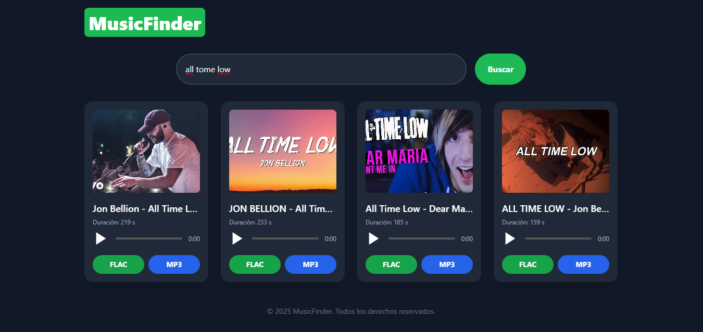

# YouTube Audio Downloader (FLAC & MP3)



Este proyecto es una aplicación web creada con **Flask** que permite buscar videos de YouTube, y descargar el audio en formato **FLAC** o **MP3** utilizando `yt-dlp`.

## Características

- 🔍 Búsqueda de videos por palabra clave.
- 🎵 Descarga del audio en formato **FLAC** (máxima calidad).
- 🎧 Opción para descargar en formato **MP3** (calidad media).
- 📷 Vista previa de miniatura, título y duración del video.

## Requisitos

- Python 3.7+
- [ffmpeg](https://ffmpeg.org/download.html)
- yt-dlp (`pip install yt-dlp`)
- Flask (`pip install flask`)

## Estructura del Proyecto

<pre><code>
├── app.py 
├── templates/ 
│ └── index.html 
└── README.md 
</code></pre>

## Instala los requisitos:

```bash
pip install flask yt-dlp
```